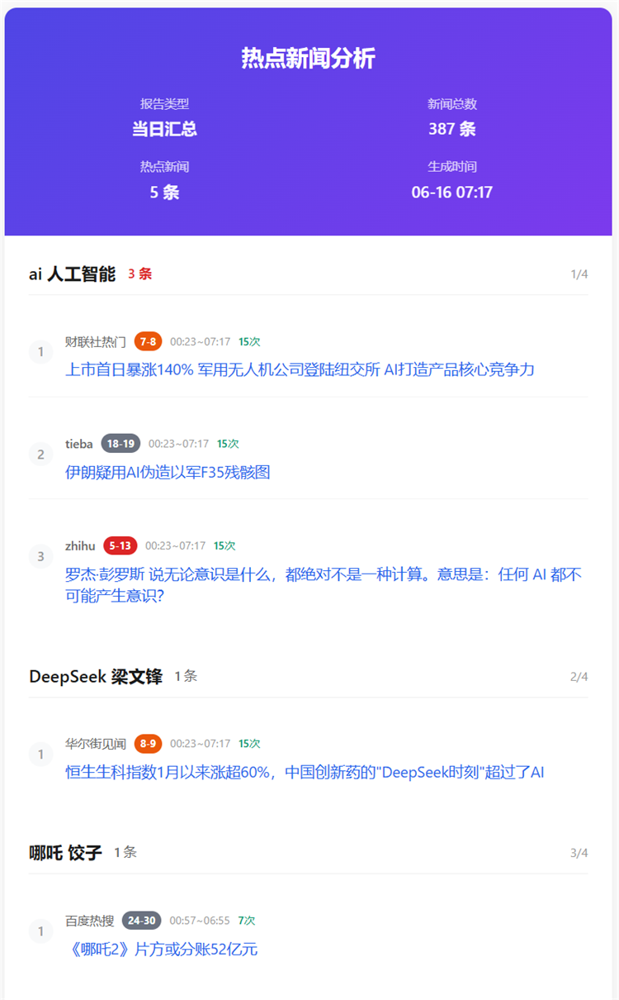

<div align="center">

# 🎯TrendRadar

🚀 最快<strong>30秒</strong>部署的熱點助手 —— 告別無效刷屏，只看真正關心的新聞資訊

[](https://github.com/sansan0/TrendRadar/stargazers)
[](https://github.com/sansan0/TrendRadar/network/members)
[](LICENSE)
[](https://github.com/sansan0/TrendRadar)

[](https://telegram.org/)
[](https://github.com/sansan0/TrendRadar)
[](https://sansan0.github.io/TrendRadar)

</div>


> 本專案以輕量、易部署為目標，主要處理 issues
>
> 遇到問題提 issues，或【硅基茶水間】公眾號留言

<details>
<summary>👉 點擊查看致謝名單 (當前 <strong>13</strong> 個)</summary>

### 資料支援

本專案使用了 [newsnow](https://github.com/ourongxing/newsnow) 專案提供的 API 接口獲取多平台資料

### 推廣助力

> 感謝以下平台和個人的推薦(按時間排列)，以及各微信群、qq群等給到這個專案幫助的人

- [小眾軟體](https://mp.weixin.qq.com/s/fvutkJ_NPUelSW9OGK39aA) - 開源軟體推薦平台
- [LinuxDo 社群](https://linux.do/) - 技術愛好者的聚集地
- [阮一峰週刊](https://github.com/ruanyf/weekly) - 技術圈有影響力的週刊


## ✨ 核心功能

### **全網熱點聚合**

- 今日頭條
- 百度熱搜
- 華爾街見聞
- 澎湃新聞
- bilibili 熱搜
- 財聯社熱門
- 鳳凰網
- 貼吧
- 微博
- 抖音
- 知乎

預設監控 11 個主流平台，如想額外增加，可看最下方的**自訂監控平台**

### **智慧推送策略**

**三種推送模式**：

- **📈 投資者/交易員** → 選擇 `incremental`，及時獲取新增資訊
- **📰 自媒體人/內容創作者** → 選擇 `current`，掌握即時熱點趨勢
- **📋 企業管理者/普通使用者** → 選擇 `daily`，定時獲取完整日報


**靜默推送模式**：

支援時間窗口控制，避免非工作時間的訊息打擾：

- **時間範圍控制**：設定推送時間窗口（如 9:00-18:00），僅在指定時間內推送
- **適用場景**：
  - 時間內每次執行都推送
  - 時間範圍內只推送一次

### **精準內容篩選**

設定個人關鍵詞（如：AI、比亞迪、教育政策），只推送相關熱點，過濾無關資訊

### **多渠道即時推送**

支援 **Telegram**，訊息直達手機

### **零技術門檻部署**

GitHub 一鍵 Fork 即可使用，無需程式設計基礎。

> 30秒部署：GitHub Pages（網頁瀏覽）
>
> 1分鐘部署：Telegram（手機通知）

**💡 提示：** 想要**即時更新**的網頁版？fork 後，進入你的儲存庫 Settings → Pages，啟用 GitHub Pages。[效果預覽](https://sansan0.github.io/TrendRadar/)。

### **減少 APP 依賴**

從「被演算法推薦綁架」變成「主動獲取自己想要的資訊」

**適合人群：** 投資者、自媒體人、企業公關、關心時事的普通使用者

**典型場景：** 股市投資監控、品牌輿情追蹤、產業動態關注、生活資訊獲取

| Github Pages效果 |
|:---:|
|  |

<details>
<summary><strong>👉 推送格式說明</strong></summary>

## 📊 輸出範例

### 通知範例：

```
📊 熱點詞彙統計

🔥 人工智慧 AI : 12 條

  1. [百度熱搜] 科技巨頭發布新AI模型 [1] - 12時30分 (4次)

  2. [今日頭條] AI技術最新突破 [2] - [13時15分 ~ 14時30分] (2次)

```

### 訊息格式說明

| 格式元素      | 範例                        | 含義         | 說明                                    |
| ------------- | --------------------------- | ------------ | --------------------------------------- |
| **關鍵詞**    | **人工智慧 AI**             | 頻率詞組     | 表示本組匹配的關鍵詞                    |
| : N 條        | : 12 條                     | 匹配數量     | 該關鍵詞組匹配的標題總數                |
| [平台名]      | [百度熱搜]                  | 來源平台     | 標題所屬的平台名稱                      |
| [**數字**]    | [**1**]                     | 高排名標記   | 排名 ≤ 閾值(預設 5)的熱搜，紅色加粗顯示 |
| [數字]        | [7]                         | 普通排名標記 | 排名>閾值的熱搜，普通顯示               |
| - 時間        | - 12 時 30 分               | 首次發現時間 | 標題首次被發現的時間                    |
| [時間 ~ 時間] | [12 時 30 分 ~ 14 時 00 分] | 時間範圍     | 標題出現的時間範圍(首次~最後)           |
| (N 次)        | (4 次)                      | 出現次數     | 標題在監控期間出現的總次數              |


</details>

## 📝 更新日誌

<details>
<summary><strong>👉 專案相關推薦</strong></summary>
<br>

> 附專案相關的兩篇文章，歡迎留言交流

- [2個月破 1000 star，我的GitHub專案推廣實戰經驗](https://mp.weixin.qq.com/s/jzn0vLiQFX408opcfpPPxQ)
- [基於本專案，如何開展公眾號或者新聞資訊類文章寫作](https://mp.weixin.qq.com/s/8ghyfDAtQZjLrnWTQabYOQ)

>**AI 開發：**
- 如果你有小眾需求，完全可以基於我的專案自行開發，零程式設計基礎的也可以試試
- 我所有的開源專案或多或少都使用了自己寫的**AI輔助軟體**來提升開發效率，這款工具已開源
- **核心功能**：迅速篩選專案程式碼餵給AI，你只需要補充個人需求即可
- **專案地址**：[https://github.com/sansan0/ai-code-context-helper](https://github.com/sansan0/ai-code-context-helper)

</details>

>**升級說明：**
- **注意**：請透過以下方式更新專案，不要透過 Sync fork 等方式更新
- **小版本更新**：直接在 GitHub 網頁編輯器中，用本專案的 `main.py` 程式碼替換你 fork 儲存庫中的對應檔案
- **大版本升級**：從 v1.x 升級到 v2.0 建議刪除現有 fork 後重新 fork，這樣更省力且避免設定衝突
- **或者**：根據更新日誌的特別說明升級

### 2025/08/30 - v2.1.0

> 感謝各位朋友的支持與厚愛，特別感謝：
>
> **fork 並為專案點 star** 的觀眾們，你們的認可是我前進的動力
>
> **關注公眾號並積極互動** 的讀者們，你們的留言和點讚讓內容更有溫度
>
> **給予資金點讚支持** 的朋友們，你們的慷慨讓專案得以持續發展
>
> 下一次**新功能**，大概會是 ai 分析功能(大概(●'◡'●)

**核心改進**：
- **推送邏輯優化**：從「每次執行都推送」改為「時間窗口內可控推送」
- **時間窗口控制**：可設定推送時間範圍，避免非工作時間打擾
- **推送頻率可選**：時間段內支援單次推送或多次推送

**更新提示**：
- 本功能預設關閉，需手動開啟
- 同時更新 main.py 和 config.yaml

<details>
<summary><strong>👉 歷史更新</strong></summary>

### 2025/08/27 - v2.0.4

- 本次版本不是功能修復，而是重要提醒
- 請務必妥善保管好 webhooks，不要公開，不要公開，不要公開
- 如果你以 fork 的方式將本專案部署在 GitHub 上，請將 webhooks 填入 GitHub Secret，而非 config.yaml
- 如果你已經暴露了 webhooks 或將其填入了 config.yaml，建議刪除後重新生成

### 2025/08/06 - v2.0.3

- 優化 github page 的網頁版效果，方便行動裝置使用

### 2025/07/28 - v2.0.2

- 重構程式碼
- 解決版本號容易被遺漏修改的問題

### 2025/07/27 - v2.0.1

**修復問題**:

1. frequency_words.txt 为空时，导致新闻发送也为空的逻辑问题
  - 修复后，当你选择 frequency_words.txt 为空时，将**推送所有新闻**，但受限于消息推送大小限制，请做如下调整
    - 方案一：關閉手機推送，只選擇 Github Pages 佈置(這是能獲得最完整資訊的方案，將把所有平台的熱點按照你**自訂的熱搜演算法**進行重新排序)
    - 方案二：模式選擇 current 或 incremental 可有效減少一次性推送的內容 

### 2025/07/17 - v2.0.0

**重大重構**：
- 設定管理重構：所有設定現在透過 `config/config.yaml` 檔案管理（main.py 我依舊沒拆分，方便你們複製升級）
- 運行模式升級：支援三種模式 - `daily`（當日匯總）、`current`（當前榜單）、`incremental`（增量監控）

**設定檔案說明**：
- `config/config.yaml` - 主設定檔（應用設定、爬蟲設定、通知設定、平台設定等）
- `config/frequency_words.txt` - 关键词配置（监控词汇设置）

### 2025/07/09 - v1.4.1

**功能新增**：增加增量推送(在 main.py 頭部設定 FOCUS_NEW_ONLY)，該開關只關心新話題而非持續熱度，只在有新內容時才發通知。

**修復問題**：某些情況下，由於新聞本身含有特殊符號導致的偶發性排版異常。

### 2025/06/23 - v1.3.0

Telegram 的推送訊息有長度限制，對此我採用將訊息拆分推送的方式。開發文檔詳見 [Telegram](https://core.telegram.org/bots/api)

### 2025/06/21 - v1.2.1

在本版本之前的舊版本，不僅 main.py 需要複製替換，crawler.yml 也需要你複製替換
https://github.com/sansan0/TrendRadar/blob/master/.github/workflows/crawler.yml

### 2025/06/19 - v1.2.0

> 感謝 claude research 整理的各平台 api，讓我快速完成各平台適配（雖然程式碼更多冗餘了~

1. 支援 Telegram 推送渠道

### 2025/06/18 - v1.1.0

> **200 star⭐** 了，繼續給大伙兒助興~近期，在我的「慫恿」下，挺多人在我公眾號點讚分享推薦助力了我，我都在後台看見了具體帳號的鼓勵資料，很多都成了天使輪老粉（我玩公眾號才一個多月，雖然註冊是七八年前的事了哈哈，屬於上車早，發車晚），但因為你們沒有留言或私訊我，所以我也無法一一回應並感謝支持，在此一併謝謝！

1. 重要的更新，加了權重，你現在看到的新聞都是最熱點最有關注度的出現在最上面
2. 更新文檔使用，因為近期更新了很多功能，而且之前的使用文檔我偷懶寫的簡單（見下面的 ⚙️ frequency_words.txt 配置完整教程）

### 2025/06/16 - v1.0.0

1. 增加了一個專案新版本更新提示，預設打開，如要關掉，可以在 main.py 中把 "FEISHU_SHOW_VERSION_UPDATE": True 中的 True 改成 False 即可

### 2025/06/13+14

1. 去掉了兼容程式碼，之前 fork 的同學，直接複製程式碼會在當天顯示異常（第二天會恢復正常）
2. html 底部增加一個新增新聞顯示

### 2025/06/09

**100 star⭐** 了，寫個小功能給大伙兒助助興
frequency_words.txt 文件增加了一个【必须词】功能，使用 + 号

1. 必须词语法如下：
   唐僧或者猪八戒必须在标题里同时出现，才会收录到推送新闻中

```
+唐僧
+猪八戒
```

2. 过滤词的优先级更高：
   如果标题中过滤词匹配到唐僧念经，那么即使必须词里有唐僧，也不显示

```
+唐僧
!唐僧念经
```

### 2025/06/02

1. **網頁**支援手機直接跳轉詳情新聞
2. 優化顯示效果 + 1


</details>


## 🚀 使用方式

1. **Fork 本專案**到你的 GitHub 帳戶

   - 點擊本頁面右上角的「Fork」按鈕

2. **設定 GitHub Secrets（選擇你需要的平台）**：

   在你 Fork 後的儲存庫中，進入 `Settings` > `Secrets and variables` > `Actions` > `New repository secret`，然後根據需要設定以下任一或多個通知平台：

   可以同時設定多個平台，系統會向所有設定的平台傳送通知。

   <details>
   <summary> <strong>👉 Telegram Bot</strong></summary>
   <br>

   **GitHub Secret 設定：**
   - 名稱：`TELEGRAM_BOT_TOKEN` - 你的 Telegram Bot Token
   - 名稱：`TELEGRAM_CHAT_ID` - 你的 Telegram Chat ID

   **機器人設定步驟：**

   1. **建立機器人**：
      - 在 Telegram 中搜尋 `@BotFather`（大小寫注意，有藍色徽章勾勾，有類似 37849827 monthly users，這個才是官方的，有一些仿官方的帳號注意辨別）
      - 傳送 `/newbot` 命令建立新機器人
      - 設定機器人名稱（必須以「bot」結尾，很容易遇到重複名字，所以你要絞盡腦汁想不同的名字）
      - 取得 Bot Token（格式如：`123456789:AAHfiqksKZ8WmR2zSjiQ7_v4TMAKdiHm9T0`）

   2. **取得 Chat ID**：

      **方法一：透過官方 API 取得**
      - 先向你的機器人傳送一條訊息
      - 訪問：`https://api.telegram.org/bot<你的Bot Token>/getUpdates`
      - 在返回的 JSON 中找到 `"chat":{"id":數字}` 中的數字

      **方法二：使用第三方工具**
      - 搜尋 `@userinfobot` 並傳送 `/start`
      - 取得你的使用者 ID 作為 Chat ID

   3. **設定到 GitHub**：
      - `TELEGRAM_BOT_TOKEN`：填入第 1 步取得的 Bot Token
      - `TELEGRAM_CHAT_ID`：填入第 2 步取得的 Chat ID
   </details>

3. **設定關鍵詞和設定**：

    - **关键词配置**：修改 `config/frequency_words.txt` 文件，添加你关心的关键词
    - **運行模式設定**：在 `config/config.yaml` 中修改 `report.mode` 設定：
      | 模式 | 推送時機 | 顯示內容 | 適用場景 |
        |------|----------|----------|----------|
        | **當日匯總模式**<br/>`daily` | 按時推送 | 當日所有匹配新聞<br/>+ 新增新聞區域 | 日報總結<br/>全面了解當日熱點趨勢 |
        | **當前榜單模式**<br/>`current` | 按時推送 | 當前榜單匹配新聞<br/>+ 新增新聞區域 | 即時熱點追蹤<br/>了解當前最火的內容 |
        | **增量監控模式**<br/>`incremental` | 有新增才推送 | 新出现的匹配频率词新闻 | 避免重複資訊干擾<br/>高頻監控場景 |

    <details>
    <summary><strong>👉 frequency_words.txt 配置教程</strong></summary>
    <br>

    在 `frequency_words.txt` 文件中配置监控的关键词，支持三种语法和词组功能。

    ### 📋 基础语法说明

    #### 1. **普通关键词** - 基础匹配
    ```txt
    华为
    OPPO
    苹果
    ```
    **作用：** 新闻标题包含其中**任意一个词**就会被捕获

    #### 2. **必须词** `+词汇` - 限定范围
    ```txt
    华为
    OPPO
    +手机
    ```
    **作用：** 必须同时包含普通词**和**必须词才会被捕获

    #### 3. **过滤词** `!词汇` - 排除干扰
    ```txt
    苹果
    华为
    !水果
    !价格
    ```
    **作用：** 包含过滤词的新闻会被**直接排除**，即使包含关键词

    ### 🔗 词组功能 - 空行分隔的重要作用

    **核心规则：** 用**空行**分隔不同的词组，每个词组独立统计

    #### 示例配置：
    ```txt
    iPhone
    华为
    OPPO
    +发布

    A股
    上证
    深证
    +涨跌
    !预测

    世界杯
    欧洲杯
    亚洲杯
    +比赛
    ```

    #### 词组解释及匹配效果：

    **第1组 - 手机新品类：**
    - 关键词：iPhone、华为、OPPO
    - 必须词：发布
    - 效果：必须包含手机品牌名，同时包含"发布"

    **匹配示例：**
    - ✅ "iPhone 15正式发布售价公布" ← 有"iPhone"+"发布"
    - ✅ "华为Mate60系列发布会直播" ← 有"华为"+"发布"
    - ✅ "OPPO Find X7发布时间确定" ← 有"OPPO"+"发布"
    - ❌ "iPhone销量创新高" ← 有"iPhone"但缺少"发布"

    **第2组 - 股市行情类：**
    - 关键词：A股、上证、深证
    - 必须词：涨跌
    - 过滤词：预测
    - 效果：包含股市相关词，同时包含"涨跌"，但排除包含"预测"的内容

    **匹配示例：**
    - ✅ "A股今日大幅涨跌分析" ← 有"A股"+"涨跌"
    - ✅ "上证指数涨跌原因解读" ← 有"上证"+"涨跌"
    - ❌ "专家预测A股涨跌趋势" ← 有"A股"+"涨跌"但包含"预测"
    - ❌ "A股成交量创新高" ← 有"A股"但缺少"涨跌"

    **第3组 - 足球赛事类：**
    - 关键词：世界杯、欧洲杯、亚洲杯
    - 必须词：比赛
    - 效果：必须包含杯赛名称，同时包含"比赛"

    **匹配示例：**
    - ✅ "世界杯小组赛比赛结果" ← 有"世界杯"+"比赛"
    - ✅ "欧洲杯决赛比赛时间" ← 有"欧洲杯"+"比赛"
    - ❌ "世界杯门票开售" ← 有"世界杯"但缺少"比赛"

    ### 🎯 配置技巧

    #### 1. **从宽到严的配置策略**
    ```txt
    # 第一步：先用宽泛关键词测试
    人工智能
    AI
    ChatGPT

    # 第二步：发现误匹配后，加入必须词限定
    人工智能
    AI
    ChatGPT
    +技术

    # 第三步：发现干扰内容后，加入过滤词
    人工智能
    AI
    ChatGPT
    +技术
    !广告
    !培训
    ```

    #### 2. **避免过度复杂**
    ❌ **不推荐：** 一个词组包含太多词汇
    ```txt
    华为
    OPPO
    苹果
    三星
    vivo
    一加
    魅族
    +手机
    +发布
    +销量
    !假货
    !维修
    !二手
    ```

    ✅ **推荐：** 拆分成多个精确的词组
    ```txt
    华为
    OPPO
    +新品

    苹果
    三星
    +发布

    手机
    销量
    +市场
    ```

    </details>


4. **自動運行**：

   - 專案已包含`.github/workflows/crawler.yml`設定檔，預設每小時運行一次
   - 你也可以在 GitHub 儲存庫的 Actions 頁面手動觸發運行

5. **查看結果**：
   - 運行結果將自動儲存在儲存庫的`output`目錄中
   - 同時透過設定的機器人傳送通知到你的群組

<details>
<summary><strong>👉 自訂監控平台</strong></summary>

### 🔧 自訂監控平台

本專案的資訊資料來源於 [newsnow](https://github.com/ourongxing/newsnow)，你可以點擊[網站](https://newsnow.busiyi.world/)，點擊[更多]，查看是否有你想要的平台。

具體新增可訪問 [專案原始碼](https://github.com/ourongxing/newsnow/tree/main/server/sources)，根據裡面的檔案名稱，在 `config/config.yaml` 檔案中修改 `platforms` 設定：

```yaml
platforms:
  - id: "toutiao"
    name: "今日頭條"
  - id: "baidu"
    name: "百度熱搜"
  - id: "wallstreetcn-hot"
    name: "華爾街見聞"
  # 新增更多平台...
```
</details>


## 📄 許可證

GPL-3.0 License

---

<div align="center">

**⭐ 如果這個工具對你有幫助，請給專案點個 Star 支持開發！**

[🔝 回到頂部](#trendradar)

</div>
